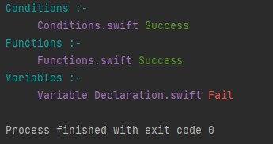

# Swift to Kotlin Converter

A compiler tool that automatically converts Swift code to Kotlin using ANTLR for parsing and custom visitor patterns for code generation. This project demonstrates compiler design principles and cross-language translation techniques.



## 🌟 Features

- **Automatic Conversion**: Translates Swift syntax to Kotlin equivalents
- **ANTLR-based Parsing**: Robust Swift grammar parsing
- **Syntax Preservation**: Maintains code structure and logic
- **Type Mapping**: Converts Swift types to Kotlin types
- **Function Translation**: Handles function declarations and calls
- **Class Conversion**: Translates classes, properties, and methods
- **Control Flow**: Supports if/else, loops, and switch statements
- **Error Reporting**: Clear error messages for unsupported features

## 🎯 Supported Features

### Language Constructs
✅ **Variables & Constants**
- `var` → `var`
- `let` → `val`

✅ **Data Types**
- `Int`, `String`, `Bool`, `Double` → Kotlin equivalents
- Arrays and Collections
- Optional types (`?`)

✅ **Functions**
- Function declarations
- Parameters and return types
- Default parameters
- Function calls

✅ **Classes & Structs**
- Class definitions
- Properties
- Methods
- Initializers

✅ **Control Flow**
- `if`/`else` statements
- `for` loops
- `while` loops
- `switch` statements

## 📸 Conversion Examples

### Example 1: Variables and Functions

**Swift Input:**
```swift
let name: String = "John"
var age: Int = 25

func greet(person: String) -> String {
    return "Hello, \(person)!"
}
```

**Kotlin Output:**
```kotlin
val name: String = "John"
var age: Int = 25

fun greet(person: String): String {
    return "Hello, $person!"
}
```

### Example 2: Classes

**Swift Input:**
```swift
class Person {
    var name: String
    var age: Int
    
    init(name: String, age: Int) {
        self.name = name
        self.age = age
    }
}
```

**Kotlin Output:**
```kotlin
class Person(var name: String, var age: Int) {
    // Constructor handled by primary constructor
}
```

## 🚀 Getting Started

### Prerequisites

- **Java JDK**: Version 8 or higher
- **ANTLR 4**: Version 4.9.2 (included in project)
- **IDE**: IntelliJ IDEA recommended (optional)

### Installation

1. **Clone the repository**
   ```bash
   git clone <your-repo-url>
   cd SwiftToKotlinConverter
   ```

2. **Compile the project**
   ```bash
   javac -cp "antlr4-4.9.2-complete.jar;." src/*.java src/generatedantlr/*.java
   ```

3. **Verify installation**
   ```bash
   java -cp "antlr4-4.9.2-complete.jar;out/production/SwiftToKotlinConverter" Main
   ```

## 📖 Usage Guide

### Converting Swift Files

1. **Place your Swift code** in `testcases/input.swift`

2. **Run the converter**
   ```bash
   java -cp "antlr4-4.9.2-complete.jar;out/production/SwiftToKotlinConverter" Main testcases/input.swift
   ```

3. **View the output** in `testcases/output.kt`

### Using in IDE

1. Open project in IntelliJ IDEA
2. Run `Main.java`
3. Provide Swift file path as argument
4. Check console for Kotlin output

### Example Command

```bash
java -cp "antlr4-4.9.2-complete.jar;out/production/SwiftToKotlinConverter" Main testcases/example.swift > output.kt
```

## 🧠 Architecture

### Components

1. **ANTLR Grammar** (`Swift3.g4`)
   - Defines Swift language syntax
   - Generates lexer and parser

2. **Lexer** (`Swift3Lexer.java`)
   - Tokenizes Swift source code
   - Identifies keywords, operators, literals

3. **Parser** (`Swift3Parser.java`)
   - Builds parse tree from tokens
   - Validates syntax

4. **Visitor** (`SwiftToKotlinVisitor.java`)
   - Traverses parse tree
   - Generates Kotlin code
   - Handles type conversions

5. **Main** (`Main.java`)
   - Entry point
   - Coordinates conversion process

### Conversion Flow

```
Swift Code → Lexer → Tokens → Parser → Parse Tree → Visitor → Kotlin Code
```

## 📁 Project Structure

```
SwiftToKotlinConverter/
├── src/
│   ├── Main.java                      # Entry point
│   ├── SwiftToKotlinVisitor.java     # Conversion logic
│   └── generatedantlr/               # ANTLR generated files
│       ├── Swift3Lexer.java
│       ├── Swift3Parser.java
│       └── Swift3Visitor.java
├── resources/
│   └── Swift3.g4                     # Swift grammar
├── testcases/                        # Test Swift files
│   ├── example1.swift
│   ├── example2.swift
│   └── ...
├── out/                              # Compiled classes
├── antlr4-4.9.2-complete.jar        # ANTLR runtime
└── README.md                         # This file
```

## 🛠️ Technology Stack

- **Java 8+**: Core language
- **ANTLR 4.9.2**: Parser generator
- **Visitor Pattern**: Code generation
- **Regex**: String processing

## 🔧 Extending the Converter

### Adding New Swift Features

1. **Update Grammar** (`Swift3.g4`)
   ```antlr
   newFeature: 'keyword' expression;
   ```

2. **Regenerate Parser**
   ```bash
   java -jar antlr4-4.9.2-complete.jar -visitor Swift3.g4
   ```

3. **Implement Visitor Method**
   ```java
   @Override
   public String visitNewFeature(Swift3Parser.NewFeatureContext ctx) {
       // Convert to Kotlin
       return "kotlin_equivalent";
   }
   ```

### Custom Type Mappings

Edit `SwiftToKotlinVisitor.java`:
```java
private String convertType(String swiftType) {
    switch (swiftType) {
        case "CustomSwiftType":
            return "CustomKotlinType";
        // Add more mappings
    }
}
```

## 📊 Limitations

**Currently Not Supported:**
- Generics
- Protocol conformance
- Extensions
- Closures (partial support)
- Advanced Swift features (guards, defer, etc.)
- SwiftUI components

**Planned Features:**
- Full closure support
- Protocol to interface conversion
- Extension methods
- Generics translation

## 🎓 Educational Value

This project demonstrates:
- **Compiler Design**: Lexing, parsing, code generation
- **ANTLR Usage**: Grammar definition and parser generation
- **Visitor Pattern**: Tree traversal and transformation
- **Language Translation**: Cross-language syntax mapping
- **Software Engineering**: Modular design and testing

## 📝 Future Enhancements

- [ ] Full Swift 5 support
- [ ] SwiftUI to Jetpack Compose conversion
- [ ] Generics translation
- [ ] Protocol to interface mapping
- [ ] Better error handling and reporting
- [ ] GUI for easier conversion
- [ ] Batch file processing

## 🐛 Troubleshooting

**ANTLR jar not found:**
```bash
# Ensure antlr4-4.9.2-complete.jar is in project root
# Download from: https://www.antlr.org/download.html
```

**Compilation errors:**
```bash
# Regenerate ANTLR files
java -jar antlr4-4.9.2-complete.jar -visitor resources/Swift3.g4
```

**Conversion produces incorrect Kotlin:**
- Check if Swift feature is supported
- Review visitor implementation
- Submit issue with example code

## 📄 License

This project is open-source and available for educational purposes.

## 🙏 Acknowledgments

- ANTLR by Terence Parr
- Swift grammar contributors
- Kotlin language team

## 📧 Contact

For questions, bug reports, or contributions, please open an issue!

---

**Note**: This is an educational project demonstrating compiler design and language translation concepts. For production use, consider established tools like Kotlin's official Swift interop.
